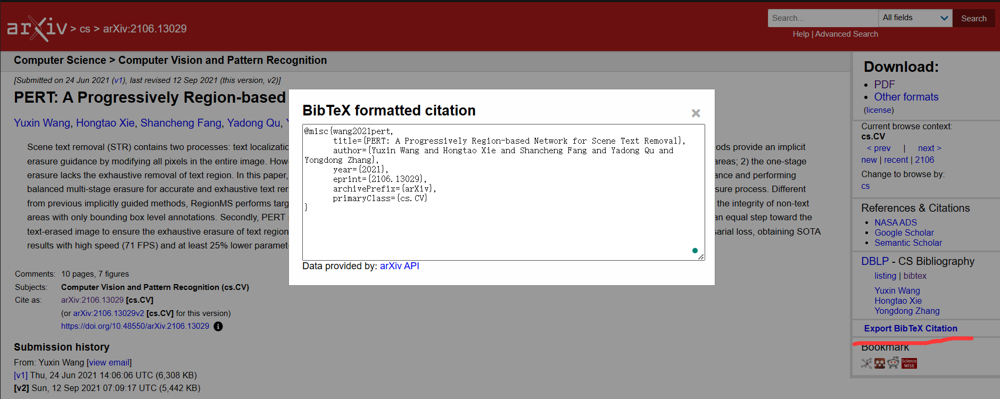
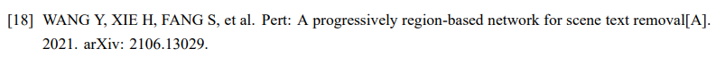

# Wuhan University of Technology Bachelor's Degree Thesis LaTeX Template 

WHUT Bachelor's Degree Thesis LaTeX Template 

Wuhan University of Technology Bachelor's Degree Thesis LaTeX Template   

武汉理工大学本科生毕业设计（论文） LaTeX 模板

武理 毕设 latex 模板


## 简介

对于已有论文写作经验的人来说，Latex无疑是一个更好更方便的工具，特别是对于理工科学生而言，Latex能更方便地插入公式、论文、图片等多种形式的内容，并且可以在一定程度上减少排版的工作量。特别在这种有了前人做好的模板的基础上，我们就可以专注于内容，不太需要考虑各种格式问题。当然，如果有前人的word模板，也能很方便地完成毕业论文。

**这是曹宇学长做的latex模板，非官方的。感谢曹宇前辈的工作和分享** 

原始链接：[https://github.com/tsaoyu/WHUT-LaTeX-bachelor](https://github.com/tsaoyu/WHUT-LaTeX-bachelor)。感谢曹宇前辈的工作和分享。我是在[https://www.latexstudio.net/archives/6530.html](https://www.latexstudio.net/archives/6530.html)  这个链接上下载的。

我在使用的过程中，遇到了一点点的小问题，特在此记录且分享出来。我本人也只是简单的使用Latex，对Latex的各种原理也不了解，以下的分享仅仅是我自己在搜集整理后，在自己的条件下可行的解决方法。不保证完全正确，仅仅是分享出来，为后来者节约一些时间。答辩完，修改时间比较短，都是一些能用就行的方案，没有仔细看。

## 1.参考文献引用。
问题：latex参考文献出现[S.1.]或[S.1.s.n.]等问题。 

原因：通过多方搜索，看起来是缺少了address、doi等信息。默认替换成了S.1 S.n等。

解决方法：一个轻松能用的解决方法，在对应的bst文件中，搜索s.1 s.n等，然后替换成""空字符串。

首先我在thesis.tex中明确使用 gbt7714-numerical。个人猜测这样他就使用了gbt7714-numerical.bst。 
原始只写了gbt7714。
\usepackage{gbt7714}                 %配置gb7714引用格式

我在此基础上指定了对应的文件。这个我粗略理解为用了空着bib引用信息的。答辩完，修改时间比较短，没有深究。
\bibliographystyle{gbt7714-numerical}

然后，在gbt7714-numerical.bst 中搜索s.1 s.n等信息，替换为空字符串。
"[S.l.]" -> ""

会有多种S.xxx信息，不放心的可以都替换掉。

## 2.Arxiv论文引用。 
问题：如何使用Latex引用仅仅上传到Arxiv上的论文。  

参考：
1. https://github.com/zepinglee/gbt7714-bibtex-style/issues/89 
2. https://www.zhihu.com/question/459978388

解决方法： 直接去Arxiv上导出bib信息，复制进bib文件里就行。谷歌学术导出的bib信息不一定对。

 

 

我个人觉得这样还说的过去。比没有Arxiv：xxxxx。这些信息更加规范一些。


## 3.手写签名以及日期
这个如果需要，直接搜索就行。

```
\begin{minipage}{2cm}
\includegraphics[height=2\baselineskip]{figure/吕光涛_手写签名.png}
\end{minipage} \quad\quad\quad\quad \\
 
\begin{minipage}{2cm}
\includegraphics[height=2\baselineskip]{figure/吕光涛_手写签名.png} 
\end{minipage} \quad\quad 2023 年 6 月  10  日\\

     
以及是否保密 打勾
$ \CheckedBox $ 

%\usepackage{wasysym} %保密那里打勾用得上 这个命令的位置放在靠后一些的地方，放的靠前会冲突。

```


## 总结
这是我在使用过程中，以及答辩之后，老师觉得格式不合理的地方。我经过多方搜索，以及自己的尝试，最终解决了问题。特此记录一下，给后来者提供一定的参考。

由于我本身只是在以往写论文过程中使用到了latex，但是对latex本身了解也不多，加上时间紧迫，很多解决方法可能不是那么合理，搜集整理和猜测的原因也不一定准确，只能说勉强可行。如果不可行，请自行使用关键词搜索，很多都是经典问题。

至于模板的使用方式可以参考前文链接，原始链接：[https://github.com/tsaoyu/WHUT-LaTeX-bachelor](https://github.com/tsaoyu/WHUT-LaTeX-bachelor)。感谢曹宇前辈的工作和分享。我是在[https://www.latexstudio.net/archives/6530.html](https://www.latexstudio.net/archives/6530.html)  这个链接上下载的。

我本身的环境是 Win10， 使用Textstudio， 默认编译器：Xelatex。

## 重点
善用搜索引擎，latex+关键词 一般都能搜到。

## 联系

有问题可以在github提issue，或者直接联系我。GuangtaoLyu（吕光涛） 1004392768@qq.com。加qq请注明来意和姓名（如果方便的话）。


